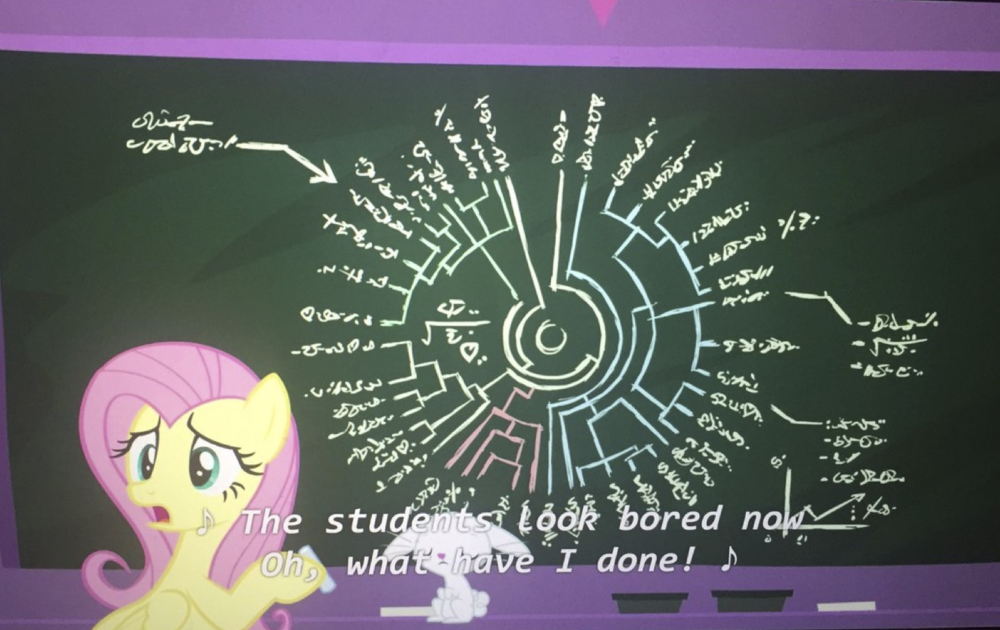

## Course taught every fall on macroevolution

### 2019

### EEB464 Macroevolution Fall 2019

Instructor: Dr. Brian C. O'Meara

Office hours: 11-12 M and by appointment: 446 Hesler

Meeting time: 10:10-11:00, MWF, Buehler 476

Description:

The course is a lecture format course with classroom discussion and participation. Students are introduced to fundamental concepts in macroevolution including current areas of debate (drivers of evolutionary rates, modes of speciation, etc.) and taught to think critically. Computer-based exercises, especially simulations, will allow students to learn how processes acting on short to medium time scales affect long term patterns. 3 credits

To understand macroevolution, it is important to learn about who, what, where, when, how, and why.

* Who: Organisms
* What: Non-living context (rocks from space, environmental conditions) Where: Biogeography (on Pangaea or Bermuda?)
* When: Geological time scale
* How: Pattern of evolution
* Why: Process of evolution

The course will cover all these areas. The ones that are most interesting, of course, are the how and especially the why. These are also the best to cover in class, where there can be discussion and other interaction. Rote learning (word meanings and the like) is something that you should be able to do on your own at this point in your education, with occasional guidance. We’re not going to use much class time on this, but you will have to learn this info. I will clearly describe what you do have to learn (and if it’s not clear, ASK), and quizzes and tests will be ways to evaluate your progress and provide further incentive to learn.

### Biology program learning objectives:

Explain and provide examples of each the five big ideas in Biology, using their knowledge of
biological concepts gained from their course of study:

* Evolution: Populations of organisms and their cellular components have changed over time through both selective and non-selective evolutionary processes. This is the main point of the course, and will be covered in every lecture and activity.
* Structure and Function: All living systems (organisms, ecosystems, etc.) are made of structural components whose arrangement determines the function of the systems. This will be highlighted especially in the discussions of morphological evolution (flight, insects, etc.)
* Information Flow and Storage: Information (DNA, for example) and signals are used and exchanged within and among organisms to direct their functioning. Origin of life will cover this extensively.
* Transformations of Energy and Matter: All living things acquire, use, and release and cycle matter and energy for cellular / organismal functioning. The discussion of escalation focuses on this, and it comes up in background on the focal organisms.
* Systems: Living systems are interconnected, and they interact and influence each other on multiple levels. Speciation, extinction, discussion, and history of life all cover this.

Demonstrate the ability to perform the following scientific practices:

* Formulate empirically-testable hypotheses. This is the point of the final presentation.
* Interpret visual representations (figures and diagrams). These will come up throughout the class, especially in the context of phylogenetic trees.
* Evaluate data and come to a conclusion (with evidence) (formulate an argument). Much of class discussion emphasizes this skill: I’ll present information and have you elaborate on this and provide potential explanations.

### Course learning objectives:

By the end of this course, students will be able to:

* Formulate, defend, and critically evaluate hypotheses about evolutionary mechanisms
* Understand the context and reason for evolutionary patterns
* Interpret information from fossils, phylogenies, and other data sources
* Generate ideas for feasible, compelling scientific projects

To really understand evolution and converse with other scientists, you have to know the names of some groups (imagine trying to talk about the history of some musical genre without knowing the names of any musicians or songs in that genre). Thus, most days, you will be responsible for learning about a particular taxon (on the syllabus, below). This could be a single species or a clade of many species. You should learn very basic info: what is it, what is it related to (i.e., where it attaches to the tree of life we will grow over the class), why it is important to know. For example: “Angiosperms: all flowering plants, lots of species, became common in the Cretaceous but may have originated earlier, sister to Gnetales.” Working together on the website forum to get this info is encouraged (you can decide to rotate the job, let whoever gets the info first post it, etc.). What I really care about is that you learn it. Note that some of the taxa may be subsets of the other taxa (elephants are a kind of vertebrate).

Writing and presentations will be graded on a variety of levels, such as grammar, structure, and substance. The purpose of grading and comments is to improve your writing. Remember that your writing is being graded, not you.

Word count sets a minimum length (and references are not counted) but you may go a bit longer if needed (try to keep below 125% of required length). Since length is judged by words, not page length, please don’t do any odd formatting of your paper (huge or tiny margins, font sizes of 8 or 18, etc.) to try to meet some page limits.

Papers/midterms will be turned in via the course website (Canvas). This eliminates issues with printers, odd file formats, and the like. The site will automatically check your work for possible plagiarism. I do this in all my classes with written work. Except where noted, assignments are to be done individually. You must cite and reference work properly. When in doubt about citation, plagiarism, or collaboration, ASK.

For help with submitting documents online, see http://online.utk.edu/students/assignment.shtml. There is a practice uploading assignment that will allow you to test to make sure you can upload files correctly before the pressure of a deadline. If there is a problem at the moment of a deadline, email me your work instead to verify it is done on time (but normally you should be using Canvas).

Communication is very important. I have set up a forum on the Canvas site for our course. If you post a question there, I will immediately be emailed about it and will respond on the forum (though perhaps not immediately). Emailing me directly will not be any faster (though do email me if the issue is better addressed one-on-one). The benefit of using the forum is that everyone can see the answers and there’s a chance that one of the other students will answer the question first. Feel free to use the forum for other class-related discussions.

Though we have the main Canvas site, and notices will come through there, I will also be posting things (like slides) to http://brianomeara.info/eeb464. Why a second site? The Canvas site is only active during the course and only to students enrolled in the course. You might want to look at the materials in other semesters, show your friends/family what you were learning, etc., so I have the public site that will persist.

Attendance is expected at all classes, though missing a class or two due to illness, family problem, etc. might happen. You can communicate with the Office of the Dean of Students (https://dos.utk.edu/absence-notifications/) if you want to document absences (and this can be easier for you than doing it separately in each of your classes). Rarely, school is also canceled due to snow.

Importantly, the Dean of Students Office can also offer you help -- the usual reasons students are absent are not happy ones, and they may be able to point you to useful resources. One great resource in general is the 974-HELP line (865-974-4357: https://dos.utk.edu/974-help/our-approach/) if you are worried about yourself or any other student, **please call that line**. Other options available from https://dos.utk.edu/, https://titleix.utk.edu/, and https://bias.utk.edu/ include ways to set up a meeting with a dean, report sexual misconduct, report bias-based incidents, or deal with other issues. I am of course happy to try to help as well.

We will have discussions in nearly all classes. You should participate in them. Sometimes, discussions in a class such as this consist of students trying to return the right answer to the instructor’s question. To avoid this, sometimes I pursue a policy of not talking during a discussion for several minutes or longer so you have to talk to each other. This can result in complete silence. If you find this annoying, talk! Even if there is not a formal discussion, please ask questions at any point during class. Please be respectful of others in class discussions. A good discussion often features students talking with each other rather than just directing comments at me. When referring to others, be careful not to use the wrong pronoun for them: I personally go by he/him, but clearly that does not work for everyone (and please let me know what pronouns work best for you). In discussions, it can also be worth separating ideas from the people thinking them: "I don't think that's how speciation works" can lead to a more fluid discussion than, "You're wrong about speciation."

Take notes. Any slides are an object to help you learn, but not the sole content: this is not a class where each slide is dense with bullet points, and as long as you can write them down on a test later, you get a good grade. There may be a slide with just a dinosaur on it and we talk for ten minutes about it: how did we know what it ate, what questions are still unresolved, etc. There are no written words on the slide, but still things you should learn from this discussion. So take notes during each class and look over them when you get home. On the final, you will be able to have a single sheet of paper with information -- you can think about what should be on that paper, and revise as you go. For taking notes, a study (Mueller and Oppenheimer, 2014, https://doi.org/10.1177/0956797614524581) suggests that you learn more taking notes by hand, on paper. That can be especially handy in this class, where we may use diagrams to illustrate concepts. I do not mandate taking notes by hand, as it does not work for everyone -- if you want to take notes using a computer or other device, that is fine -- but do try taking notes by hand if it might work for you. You may also record the class; I only ask that you respect your classmates' privacy (people are learning, they should be getting things wrong and taking the risk of giving incorrect answers: I do not want people to be afraid of what they say being misused later).

Late work is penalized at 10%/day (so something turned in 49 hours late is given a score 70% of what it would have received on the due date). Extensions are not normally granted. Remember that even if you turn something in seven days late, it is still worth more points than not turning it in at all (and the grading for the class is just #points received / #points available, so something getting 20/100 points is still worth twice something getting 10/100 points, even though they are both an “F” individually).

My goal is to have you learn. If you are having trouble with something in the course, or if there is a topic you just have to learn more about, let me know (email, office hours, online forum, etc.). Faculty often use evaluations at the end of the semester to get info from students so we can improve before the next class, but this does not help you directly. To allow the class to improve while you are taking it, I have created a site for anonymous feedback at http://brianomeara.info/feedback.html (and yes, it is really anonymous). Let me know things that are going well or poorly — both are important. I might not implement all your suggestions, but they will all be read and considered, generally the same day you submit them.

Please contact Student Disability Services (https://sds.utk.edu/) if you may need an appropriate accommodation plan.

I never went to office hours as a student. That was a bad idea. Office hours are ways for you to talk to instructors about topics in the course or related issues -- if you want to talk to me about applying to grad school, or labs you can do research in here, or a cool paper you read, come to office hours!

All relevant University policies (including, but not limited to, policies on academic integrity, attendance, etc.) apply to this course. In the case of any conflict between the policies in this syllabus and University policy, University policy applies. The instructor reserves the right to revise, alter, and/or amend this syllabus as necessary. Students will be notified by email of any such revisions, alterations, and/or amendments.

### Grading

* 100 points: Topic review. 1000 words, including references. Cover a macroevolutionary question: what is known about it, what is the state of work on it, what work might be done in the future? Work should be individual.
* 100 points: Pair presentation. Imagine you are trying to get money to study a macroevolutionary question. You have to make a compelling case to a potential funder (i.e., the NSF will give you $15K to study it, or a professor might offer you a place in her lab to work on this). You should include 1) why that question is interesting (this should include what is known about it), 2) how you plan to address it, 3) what potential outcomes of your work may be, and 4) the implications of these. 10 minute talk (PowerPoint, Keynote, PDF, etc.). Be sure to include references in your slides.
* 50 points: Class work. This includes quizzes, activities, and other in class assignments. In general, these will not be announced in advance. Note that 80 points will actually be assigned but the maximum score possible will be 50 points. The goal of this is to allow you to miss some classes without needing to bring a note justifying your absence.
* 100 points each: Take home midterms. You may NOT work with classmates or other humans, but you can use notes, books, papers, etc. (though do not plagiarize them, not that the questions will be ones you can typically plagiarize).
* 200 points: Final exam. Similar to the midterm, but with a bit more evaluation of rote knowledge.

In addition to these assignments, students will periodically be given articles to read for later discussion. Quizzes or other assignments will assess whether the articles have been read (and will be part of the class work grade).

Final letter grades will be assigned at the end of the semester using an instructor-specified scale. I aim for grading consistency across years and with other courses at UTK. A typical scale for this class is below.

| Grade | Cutoff | Proportion of students |
| ----- | ------ | ---------------------- |
| A     | 92     | 36%                    |
| A-    | 90     | 14%                    |
| B+    | 88     | 0%                     |
| B     | 82     | 41%                    |
| B-    | 80     | 0%                     |
| C+    | 78     | 5%                     |
| C     | 72     | 0%                     |
| worse | <72    | 5%                     |

### Schedule

| #   | Date   | Topic                       | Taxon to learn           | Assignment            |
| --- | ------ | --------------------------- | ------------------------ | --------------------- |
| 1   | 21-Aug | Pre-test, syllabus          |                          |                       |
| 2   | 23-Aug | [History of planet & life I](files/UTKEEB464_Lecture1_History1_2019.pdf)  | Crinoid                  |                       |
| 3   | 26-Aug | [History of planet & life II](files/UTKEEB464_Lecture02_History2_2019.pdf) | Archaea                  |                       |
| 4   | 28-Aug | [Evidence](files/UTKEEB464_Lecture03_Evidence_2019.pdf)                    | *Anomalocaris*           |                       |
| 5   | 30-Aug | [Taphonomy](files/UTKEEB464_Lecture04_Taphonomy_2019.pdf)                   | Trilobite                |                       |
|     | 2-Sep  | Labor day                   |                          |                       |
| 6   | 4-Sep  | [Jargon](files/UTKEEB464_Lecture05_Jargon_2019.pdf)                    | *Acromyrmex*             |                       |
| 7   | 6-Sep  | [Phylogenetics](files/UTKEEB464_Lecture06_Phylogenetics_2019.pdf)     | Spiny anteater           |                       |
| 8   | 9-Sep  | [Empirical Distributions](files/UTKEEB464_Lecture07_EmpiricalDistributions_2019.pdf)                | Geospizinae              |                       |
| 9   | 11-Sep | [Biogeography](files/UTKEEB464_Lecture08_Biogeography_2019.pdf)                | *Wolbachia*              |                       |
| 10  | 13-Sep | [Speciation I](files/UTKEEB464_Lecture09_Speciation1_2019.pdf)               | *Anolis*                 |                       |
| 11  | 16-Sep | [Speciation II](files/UTKEEB464_Lecture10_Speciation2_2019.pdf)                 | *Gasterosteus aculeatus* |                       |
| 12  | 18-Sep | [Extinction I](files/UTKEEB464_Lecture11_Extinction1_2019.pdf)               | Brachiopod               |                       |
| 13  | 20-Sep | [Diversification I](files/UTKEEB464_Lecture12_Diversification1_2019.pdf)           | Isopod                   | Midterm 1 distributed |
| 14  | 23-Sep | [Diversification II](files/UTKEEB464_Lecture13_Diversification2_2019.pdf)         | *Amborella*              |                       |
| 15  | 25-Sep | [Natural selection & drift](files/UTKEEB464_Lecture14_NaturalSelection_2019.pdf)   | *Tribolium*              |                       |
| 16  | 27-Sep | [Sex](files/UTKEEB464_Lecture15_Sex_2019.pdf)                         | Bdelloid rotifer         | Midterm 1 due at 8 pm |
| 17  | 30-Sep | [Trends](files/UTKEEB464_Lecture16_Trends_2019.pdf)              | Lichen                   |                       |
| 18  | 2-Oct  | [Symbiosis](files/UTKEEB464_Lecture17_Symbiosis_2019.pdf)           | Naked mole rat           |                       |
| 19  | 4-Oct  | [Inclusive fitness](files/UTKEEB464_Lecture18_InclusiveFitness_2019.pdf)                   | Fig wasp                 |                       |
| 20  | 7-Oct  | [Game Theory](files/UTKEEB464_Lecture19_GameTheory_2019.pdf)             |                          | Talk                  |
| 21  | 9-Oct  | [Darwin](files/UTKEEB464_Lecture20_Darwin_2019.pdf)             |                          |                   |
| 22  | 11-Oct | [Systematics](files/UTKEEB464_Lecture21_Systematics_2019.pdf)             |                          |                   |
| 23  | 14-Oct | Presentations 1                      | *Maiasaura*              |                       |
| 24  | 16-Oct | Presentations 2                      | *Dionaea muscipula*      |                       |
|     | 18-Oct | Fall break                  |                          |                       |
| 25  | 21-Oct | [Disease evolution](files/UTKEEB464_Lecture22_DiseaseEvolution_2019.pdf)                 | Ground sloth             |                       |
| 26  | 23-Oct | [Adaptationism / SJ Gould](files/UTKEEB464_Lecture23_2019_StephenJayGould.pdf)          | *Thermus aquaticus*      | |
| 27  | 25-Oct |  [Flight](files/UTKEEB464_Lecture24_Flight_2019.pdf) | Lycophytes               |                       |
| 28  | 28-Oct |  [Insects](files/UTKEEB464_Lecture25_Insects_2019.pdf)   | *Spinosaurus*            |                       |
| 29  | 30-Oct | [Language evolution](files/UTKEEB464_Lecture26_LanguageEvolution_2019.pdf)          | Bonobo                   |  |
| 30  | 1-Nov  |  [Domestication](files/UTKEEB464_Lecture27_2019_Domestication.pptx)          | *Buchnera*               |                       |
| 31  | 4-Nov  | [Origin of life](files/UTKEEB464_Lecture28_OriginOfLife_2019.pdf)   | Cuttlefish               |                       |
| 32  | 6-Nov  |   [Invasive humans](files/UTKEEB464_Lecture29_InvasiveHumans_2019.pdf)                    | Silverfish               |                       |
| 33  | 8-Nov  | [Evolution of intelligence](UTKEEB464_Lecture30_2019_EvolutionOfIntelligence.pdf)           | Cave bear                |                       |
| 34  | 11-Nov | Contemporary Evolution      | Malaria                  |                       |
| 35  | 13-Nov | Recent discoveries          | *Trillium*               |                       |
| 36  | 15-Nov | Evolutionary medicine       | HIV                      |                       |
| 37  | 18-Nov | Domestication               | Passiflora               | Paper due at 8 pm     |
| 38  | 20-Nov | Free topic 1                |                          |                       |
| 39  | 22-Nov | Free topic 2                |                          |                       |
| 40  | 25-Nov | Free topic 3                |                          |                       |
|     | 27-Nov | No class                    |                          |                       |
|     | 29-Nov | No class                    |                          |                       |
| 41  | 2-Dec  | Paleoart                    | *Quetzalcoatlus*         |                       |
| 42  | 4-Dec  | Review                      |                          |                       |
|     | 9-Dec  | **Final** 10:15 am          |                          |                       |

#### Midterm 1:

12.5 points per question. Do not talk to any human about the questions, but looking information up is ok.
 
1. “We think early metazoan life was marine due to taphonomic bias,” says your friend. Argue for or against this statement.
2. Describe Dobzhansky-Muller incompatibilities and their importance.
3. Describe a major event in earth history and how life would be different today had it not happened. It cannot be the KT extinction or the end Permian extinction. 
4. What would happen if Australia merged again with South America due to continental drift? 
5. Give three examples, not from class, of how we can use phylogenies to understand macroevolution. 
6. There is a fairly new method that lets you predict a speciation rate from the age of a species. How will you know if you can trust this?
7. How is knowing about causes of modern extinctions useful for understanding past extinctions? How could it be misleading?
8. Neanderthals and Homo sapiens interbred successfully in the past. A. Does this mean we were the same species? B. Why or why not? C. Does this matter, and why / why not?

### 2018

EEB 464 Macroevolution Fall 2018

Instructor: Dr. Brian C. O'Meara

Office hrs: 11-12 M and by appointment; 446 Hesler

Meeting time: 10:10-11:00 MWF, 412 Buehler

Description:

The course is a lecture format course with classroom discussion and
participation. Students are introduced to fundamental concepts in
macroevolution including current areas of debate (drivers of
evolutionary rates, modes of speciation, etc.) and taught to think
critically. Computer-based exercises, especially simulations, will allow
students to learn how processes acting on short to medium time scales
affect long term patterns. 3 credits

To understand macroevolution, it is important to learn about who, what,
where, when, how, and why.

Who: Organisms

What: Non-living context (rocks from space, environmental conditions)

Where: Biogeography (on Pangaea or Bermuda?)

When: Geological time scale

How: Pattern of evolution

Why: Process of evolution

The course will cover all these areas. The ones that are most
interesting, of course, are the how and especially the why. These are
also the best to cover in class, where there can be discussion and other
interaction. Rote learning (word meanings and the like) is something
that you should be able to do on your own at this point in your
education, with occasional guidance. We're not going to use much class
time on this, but you will have to learn this info. I will clearly
describe what you do have to learn (and if it's not clear, ASK), and
quizzes and tests will be ways to evaluate your progress and provide
further incentive to learn.

**Biology program learning objectives:**

I include how this course addresses these in *italics.*

Explain and provide examples of each the five big ideas in Biology,
using their knowledge of biological concepts gained from their course of
study:

-   Evolution: Populations of organisms and their cellular components
    have changed over time through both selective and non-selective
    evolutionary processes. *This is the main point of the course, and
    will be covered in every lecture and activity.*

-   Structure and Function: All living systems (organisms, ecosystems,
    etc.) are made of structural components whose arrangement determines
    the function of the systems. *This will be highlighted especially in
    the discussions of morphological evolution (flight, insects, etc.)*

-   Information Flow and Storage: Information (DNA, for example) and
    signals are used and exchanged within and among organisms to direct
    their functioning. *Origin of life will cover this extensively.*

-   Transformations of Energy and Matter: All living things acquire,
    use, and release and cycle matter and energy for cellular /
    organismal functioning. *The discussion of escalation focuses on
    this, and it comes up in background on the focal organisms.*

-   Systems: Living systems are interconnected, and they interact and
    influence each other on multiple levels. *Speciation, extinction,
    discussion, and history of life all cover this.*

Demonstrate the ability to perform the following scientific practices:

-   Formulate empirically-testable hypotheses. *This is the point of the
    final presentation.*

-   Interpret visual representations (figures and diagrams). *These will
    come up throughout the class, especially in the context of
    phylogenetic trees.*

-   Evaluate data and come to a conclusion (with evidence) (formulate an
    argument). *Much of class discussion emphasizes this skill: I'll
    present information and have you elaborate on this and provide
    potential explanations.*

**Course learning objectives:**

By the end of this course, students will be able to:

-   Formulate, defend, and critically evaluate hypotheses about
    evolutionary mechanisms

-   Understand the context and reason for evolutionary patterns

-   Interpret information from fossils, phylogenies, and other data
    sources

-   Generate ideas for feasible, compelling scientific projects

To really understand evolution and converse with other scientists, you
have to know the names of some groups (imagine trying to talk about the
history of some musical genre without knowing the names of any musicians
or songs in that genre). Thus, most days, you will be responsible for
learning about a particular taxon (on the syllabus, below). This could
be a single species or a clade of many species. You should learn very
basic info: what is it, what is it related to (i.e., where it attaches
to the tree of life we will grow over the class), why it is important to
know. For example: "Angiosperms: all flowering plants, lots of species,
became common in the Cretaceous but may have originated earlier, sister
to Gnetales." Working together on the website forum to get this info is
encouraged (you can decide to rotate the job, let whoever gets the info
first post it, etc.). What I really care about is that you learn it.
Note that some of the taxa may be subsets of the other taxa (elephants
are a kind of vertebrate).

Writing and presentations will be graded on a variety of levels, such as
grammar, structure, and substance. The purpose of grading and comments
is to improve your writing. Remember that your writing is being graded,
not you.

Word count sets a minimum length (and references are not counted) but
you may go a bit longer if needed (try to keep below 125% of required
length). Since length is judged by words, not page length, please don't
do any odd formatting of your paper (huge or tiny margins, font sizes of
8 or 18, etc.) to try to meet some page limits.

Papers/midterms will be turned in via the course website (Canvas). This
eliminates issues with printers, odd file formats, and the like. The
site will automatically check your work for possible plagiarism. I do
this in all my classes with written work. Except where noted,
assignments are to be done individually. You must cite and reference
work properly. **When in doubt about citation, plagiarism, or
collaboration, ASK.** Please turn in work as plain text or RDF. This
makes it easier for me to put them in one document so I can give you
back grades with comments.

For help with submitting documents online, see
http://online.utk.edu/students/assignment.shtml. There is a practice
uploading assignment that will allow you to test to make sure you can
upload files correctly before the pressure of a deadline. If there is a
problem at the moment of a deadline, email me your work instead to
verify it is done on time (but normally you should be using Canvas).

Communication is very important. I have set up a forum on the Canvas
site for our course. If you post a question there, I will immediately be
emailed about it and will respond on the forum (though perhaps not
immediately). Emailing me directly will not be any faster (though do
email me if the issue is better addressed one-on-one). The benefit of
using the forum is that everyone can see the answers and there's a
chance that one of the other students will answer the question first.
Feel free to use the forum for other class-related discussions.

Though we have the main Canvas site, and notices will come through
there, I will also be posting things (like slides) to
<http://brianomeara.info/category/macroevolution/> . Why a second site?
The Canvas site is only active during the course and only to students
enrolled in the course. You might want to look at the materials in other
semesters, show your friends/family what you were learning, etc., so I
have the public site that will persist.

Attendance is expected at all classes, though missing a class or two due
to illness, family problem, etc. might happen (and is strongly suggested
in the case of flu: <http://studenthealth.utk.edu/common_avoidflu.php> )

We will have discussions in nearly all classes. You should participate
in them. Sometimes, discussions in a class such as this consist of
students trying to return the right answer to the instructor's question.
To avoid this, sometimes I pursue a policy of not talking during a
discussion for several minutes or longer so you have to talk to each
other. This can result in complete silence. If you find this annoying,
talk! Even if there is not a formal discussion, please ask questions at
any point during class.

Late work is penalized at 10%/day (so something turned in 49 hours late
is given a score 70% of what it would have received on the due date).
Extensions are not normally granted, except under extraordinary
circumstances (having too much work to do does not qualify, for
example). Remember that even if you turn something in seven days late,
it is still worth more points than not turning it in at all (and the
grading for the class is just \#points received / \#points available, so
something getting 20/100 points is still worth twice something getting
10/100 points, even though they are both an "F" individually).

My goal is to have you learn. If you are having trouble with something
in the course, or if there is a topic you just have to learn more about,
let me know (email, office hours, online forum, etc.). Faculty often use
evaluations at the end of the semester to get info from students so we
can improve before the next class, but this does not help you directly.
**To allow the class to improve while you are taking it, I have created
a site for anonymous feedback at
http://brianomeara.info/teaching/feedback/** (and yes, it is really
anonymous). Let me know things that are going well or poorly --- both
are important. I might not implement all your suggestions, but they will
all be read and considered, generally the same day you submit them.

Any student who feels s/he may need an accommodation based on the impact
of a disability should contact me privately to discuss specific needs.
Please contact the Office of Disability Services at 865-974-6087 in
Dunford Hall to coordinate reasonable accommodations for students with
documented disabilities.

All relevant University policies (including, but not limited to,
policies on academic integrity, attendance, etc.) apply to this course.
In the case of any conflict between the policies in this syllabus and
University policy, University policy applies. The instructor reserves
the right to revise, alter, and/or amend this syllabus as necessary.
Students will be notified by email of any such revisions, alterations,
and/or amendments.

**\
Grading:**

100 points: Topic review. 1000 words, including references. Cover a
macroevolutionary question: what is known about it, what is the state of
work on it, what work might be done in the future? Work should be
individual.

100 points: Pair presentation. Imagine you are trying to get money to
study a macroevolutionary question. You have to make a compelling case
to a potential funder (i.e., the NSF will give you \$15K to study it, or
a professor might offer you a place in her lab to work on this). You
should include 1) why that question is interesting (this should include
what is known about it), 2) how you plan to address it, 3) what
potential outcomes of your work may be, and 4) the implications of
these. 10 minute talk (PowerPoint, Keynote, PDF, etc.). Be sure to
include references in your slides.

50 points: Class work. This includes quizzes, activities, and other in
class assignments. In general, these will not be announced in advance.
Note that 80 points will actually be assigned but the maximum score
possible will be 50 points. The goal of this is to allow you to miss
some classes (due to illness, death in the family, or other such
reasons) without needing to bring a note justifying your absence.

100 points each: Take home midterms. You may NOT work with classmates or
other humans, but you can use notes, books, papers, etc. (though do not
plagiarize them, not that the questions will be ones you can typically
plagiarize).

200 points: Final exam. Similar to the midterm, but with a bit more
evaluation of rote knowledge.

In addition to these assignments, students will periodically be given
articles to read for later discussion. Quizzes or other assignments will
assess whether the articles have been read.

Final letter grades will be assigned at the end of the semester using an
instructor-specified scale. I aim for grading consistency across years
and with other courses at UTK.

#### Presentations

Here are all the presentations. Each class starts with learning objectives for that class.

* History of earth 1 [pdf](files/UTKEEB464_Lecture01_History1_2018.pdf)
* History of earth 2 [pdf](files/UTKEEB464_Lecture02_History2_2018.pdf)
* Evidence [pdf](files/UTKEEB464_Lecture03_Evidence_2018.pdf)
* Taphonomy [pdf](files/UTKEEB464_Lecture04_Taphonomy_2018.pdf)
* Jargon [pdf](files/UTKEEB464_Lecture05_Jargon_2018.pdf)
* Phylogenetics [pdf](files/UTKEEB464_Lecture06_Phylogenetics_2018.pdf)
* Empirical distributions [pdf](files/UTKEEB464_Lecture07_EmpiricalDistributions_2018.pdf)
* Biogeography [pdf](files/UTKEEB464_Lecture08_Biogeography_2018.pdf)
* Speciation 1 [pdf](files/UTKEEB464_Lecture09_Speciation1_2018.pdf)
* Speciation 2 [pdf](files/UTKEEB464_Lecture10_Speciation2_2018.pdf)
* Extinction 1 [pdf](files/UTKEEB464_Lecture11_Extinction1_2018.pdf)
* Extinction 2 [pdf](files/UTKEEB464_Lecture12_Extinction2_2018.pdf)
* Diversification 1 [pdf](files/UTKEEB464_Lecture13_Diversification_2018.pdf)
* Diversification 2 [pdf](files/UTKEEB464_Lecture14_Diversification2_2018.pdf)
* Natural selection [pdf](files/UTKEEB464_Lecture15_NaturalSelection_2018.pdf)
* Sex [pdf](files/UTKEEB464_Lecture16_Sex_2018.pdf)
* Trends [pdf](files/UTKEEB464_Lecture17_Trends_2018.pdf)
* Symbiosis [pdf](files/UTKEEB464_Lecture18_Symbiosis_2018.pdf)
* Game theory [pdf](files/UTKEEB464_Lecture19_GameTheory_2018.pdf)
* Inclusive fitness [pdf](files/UTKEEB464_Lecture20_InclusiveFitness_2018.pdf)
* Systematics [pdf](files/UTKEEB464_Lecture21_Systematics_2018.pdf)
* Darwin [pdf](files/UTKEEB464_Lecture22_Darwin_2018.pdf)
* Disease evolution [pdf](files/UTKEEB464_Lecture22_Darwin_2018.pdf)
* Flight [pdf](files/UTKEEB464_Lecture24_Flight_2018.pdf)
* Invasive humans [pdf](files/UTKEEB464_Lecture25_InvasiveHumans_2018.pdf)
* Origin of life [pdf](files/UTKEEB464_Lecture26_OriginOfLife_2018.pdf)
* Contemporary evolution [pdf](files/UTKEEB464_Lecture27_ContemporaryEvolution_2018.pdf)
* Language evolution [pdf](files/UTKEEB464_Lecture28_2018_LanguageEvolution.pdf)
* Domestication [pdf](files/UTKEEB464_Lecture29_2018_Domestication.pdf)
* Stephen Jay Gould [pdf](files/UTKEEB464_Lecture30_2018_StephenJayGould.pdf)
* Insects [pdf](files/UTKEEB464_Lecture31_Insects_2018.pdf)
* Evolution of intelligence [pdf](files/UTKEEB464_Lecture32_2018_EvolutionOfIntelligence.pdf)
* Spider evolution [pdf](files/UTKEEB464_Lecture33_SpiderEvolution_2018.pdf)
* Paleoart [pdf](files/UTKEEB464_Lecture34_Paleoart_2018.pdf)

#### Study guide

1.	Why may life have been single celled for a long time?
2.	Describe a major event (such as a mass extinction, colonization of land, etc.) and its subsequent effects.
3.	How do we learn about organisms with no living descendants, such as trilobites? How would living descendants affect how we can learn about them?
4.	Can behavior be fossilized? If so, give two examples.
5.	How can something become a fossil?
6.	How has continental drift affected the location of organisms?
7.	Why don’t barracuda eat cleaner wrasse?
8.	Why bother making phylogenies?
9.	What is a phylogeny?
10.	Are species statistically independent?
11.	How can movement of land lead to speciation?
12.	What was the Great Faunal Interchange?
13.	Describe island biogeography. Why is it relevant to this class?
14.	Contrast pre and postzygotic mating barriers
15.	What are Dobzhansky-Muller Incompatibilities?
16.	Compare allopatric and sympatric speciation.
17.	How might hybrids have greater fitness than their parents?
18.	Explain the importance of Wolbachia.
19.	Describe the cause of a contemporary group of extinctions.
20.	Give an example of a biological trait that may increase extinction risk. Why might it?
21.	How could phylogenetic diversity be useful for conservation?
22.	Describe a simple model for species diversification.
23.	Compare and contrast speciation rate and diversification rate.
24.	How may trait transitions and diversification rates together affect evolution of a group?
25.	Which requirement for natural selection is most important? Why?
26.	What, in the context of this class, is an advantage of sexual reproduction?
27.	Describe Muller’s ratchet
28.	Describe one mechanism of sexual selection.
29.	What is Cope’s rule? Why might it be true?
30.	Contrast a passive and an active trend.
31.	How would you detect evidence of a trend?
32.	Contrast mutualism with parasitism. How can one change into the other?
33.	Give an example of a commensalism.
34.	What is an evolutionarily stable strategy?
35.	Why is “the good of the species” a problematic concept?
36.	Why might potential prey call out to a predator?
37.	What is inclusive fitness?
38.	What is Hamilton’s rule?
39.	Give a behavior the idea of inclusive fitness could explain.
40.	Why can delimiting two species be hard?
41.	Relate Darwin’s work on reefs to his work on evolution.
42.	What are some potential reasons that gliding evolves much more often than flight?
43.	Why does science utilize peer review?
44.	What evidence links humans to some megafaunal extinctions?
45.	How did Gould contribute to macroevolution?
46.	What is the utility of simulation for understanding macroevolution?
47.	Pasteur showed life does not spontaneously appear. Biologists believe life originally spontaneously appeared. Reconcile these views.
48.	Use insects as an example of a macroevolutionary process.
49.	What factors affect evolution of virulence? Why?
50.	What is domestication? How does it happen?
51.	Does flight lead to lower extinction risk? What is your hypothesis, and how would you evaluate this?
52.	How can we assess whether (pre-writing) human arrival in an area led to an extinction of macrofauna?
53.	Give an example from class of evolution happening in modern humans.
54.	Compare and contrast a squid, human, and fly eye. Are they homologous?
55.	Draw a phylogeny of 10 species; label three synapomorphies.
56.	Based on information from this class, why is there only evidence for one origin of life on the planet?
57.	How can we reconstruct language evolution?
58.	Are mutations usually adaptive? How do we know?
59.	How has paleoart for dinosaurs changed over time?
60.	How does paleoart matter for macroevolution?
61.	Describe major events in spider evolution
62.	Which is more intelligent, dolphins or ravens? How would you test this?
