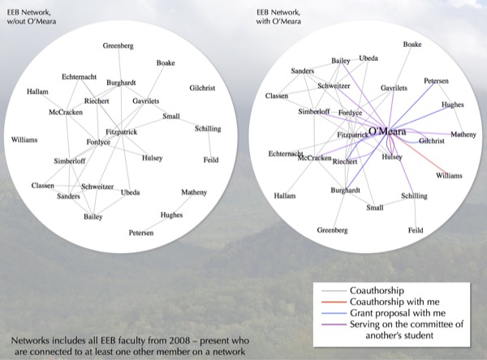
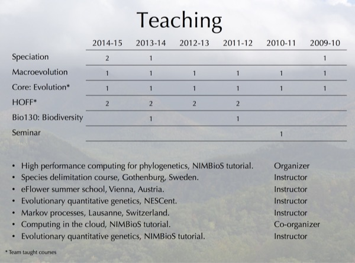
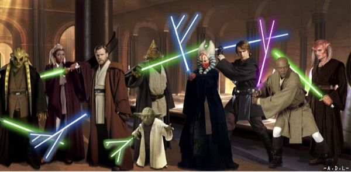

I was up for tenure in the Department of Ecology and Evolutionary Biology at the U. of Tennessee, Knoxville, over the 2014-2015 school year. This involves being evaluated at the department, college, and university level for a history of research, teaching, and service. If ultimately approved (it was in my case), it results in great job security (though not absolute, which is probably good); if rejected, it results in a year to find another position before being fired.
There is a tenure dossier prepared by the candidate and then added to by the department head. The head writes their own letter as well as solicits letters from external senior faculty regarding the candidate's research. I do not have ready access to the final dossier (though, given Tennessee's sunshine laws, everything, including letters, is available by request), but I do have access to the parts I wrote. I include it here as a [PDF](files/OMearaTenurePacketPreliminary.pdf); note I have redacted a section about students on whose committees I have served (there are many in various departments).

I also gave a tenure talk to the department on Nov. 7, 2014.

*Note in 2019: This is kept online in case it helps others going up for tenure to have a template. Remember the bias we often have when looking at things like this: many of us tend to focus on the things where we're "not as good" as the template, but ignore the many cases where we are actually "better." I'm not sure that this particular document will create such feelings, but know that it's likely I'd feel the same reading your packet.*

* Tenure packet [PDF](files/OMearaTenurePacketPreliminary.pdf)
* Slides as PDF ([part 1](files/OMeara_Tenure_2014_part1.pdf), [part 2](files/OMeara_Tenure_2014_part2.pdf), [part 3](files/OMeara_Tenure_2014_part3.pdf))
* Slides as [PowerPoint](files/OMeara_Tenure_2014.pptx) (76 MB)
* Video recording of talk is [here](https://www.youtube.com/watch?v=cMky-utTWLk) on YouTube. Note that I was fairly ill during and in the lead up to the talk, so there is a lot of coughing (the wrong kind of "hackathon"). This is the only recording of the teaching, service, and overview parts of the talk, but you can hear better versions of the [ABC](https://www.youtube.com/watch?v=g6iL4kHbM54&list=UUzzg8khzVttwFpti4htKw7Q), [floral evolution](https://www.youtube.com/watch?v=gRQjS6M7BXE), and [phylogeography](https://www.youtube.com/watch?v=UC4Mj1K6c0k) sections here based on recordings of my other talks on these subjects, using similar slide decks.

Over the course of my time as an assistant professor, I have:

  * Addressed questions about how species move through landscapes, what limits rates of evolution, predictability of evolution, competition between organisms, and more

  * Creation of methods and open software to deal with rate heterogeneity for discrete characters, more flexible ways of dealing with continuous characters, simulating millions of species, examining correlations, and much more

  * Taught hundreds of students to think critically and to understand science as a process

  * Mentored 4 students and 10 postdocs

  * 28 grant proposals (including 16 full and 5 preproposals to NSF), $1.4M in external funds

  * Service in improving representation of women in science, Darwin Day outreach, numerous workshops, hackathons, and conferences

**Talk animated GIF**

**Some unusual or key slides from the talk:**

Figure showing my integration into this department. The connections within the department were one of the things that made this position attractive, and I have formed many connections since arriving.

* * *

Teaching load by year (numbers refer to number of semesters I taught that course that year) as well as some external courses (research talks are not included in this list). This semester (Fall 2014) I am teaching an undergrad/grad macroevolution class (~28 students), a speciation seminar (~15 students), co-teaching our graduate core evolution class, and co-teaching a multi-lab discussion group.

* * *

Support from various sources as an assistant professor: PI on two NSF grants, Co-PI on a third, plus funding from various other grants (iPlant, EOL, and others) which have all been very helpful.

* * *

A tongue-in-cheek artist's depiction of the Council of the Society for Systematic Biologists.
I am an elected member of this council as just one of my service activities, which include co-organizing Evolution 2014, iEvoBio, and Phylotastic hackathons, being the faculty advisor for Darwin Day Tennessee, organizing various initiatives to improve diversity in science, maintaining the [CRAN Task View for Phylogenetics](http://cran.r-project.org/web/views/Phylogenetics.html), plus various other department, college, and professional service activities.
Original image from user [ThatGuyWithHeadPhones](http://www.comicvine.com/forums/battles-7/akatsuki-vs-jedi-council-1451424/), modified by me.
