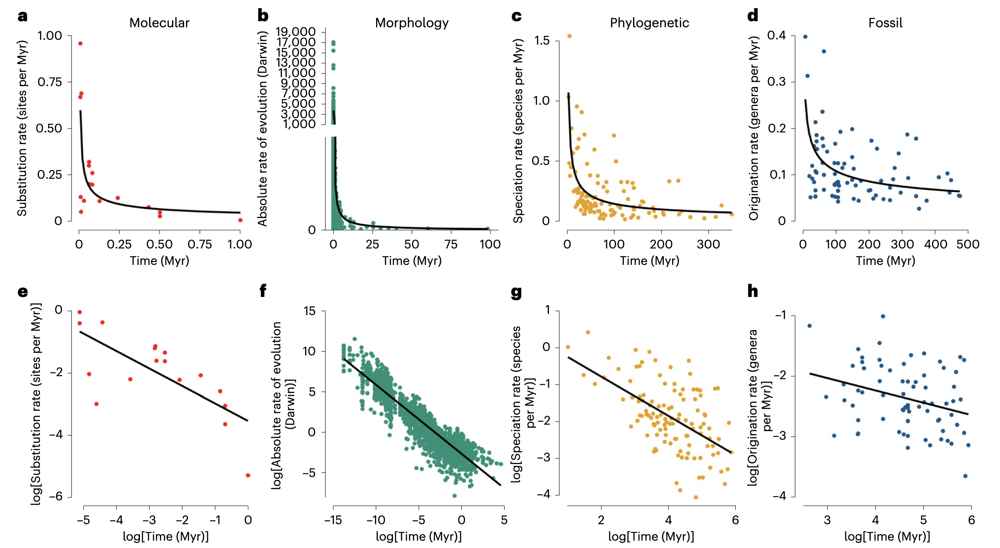
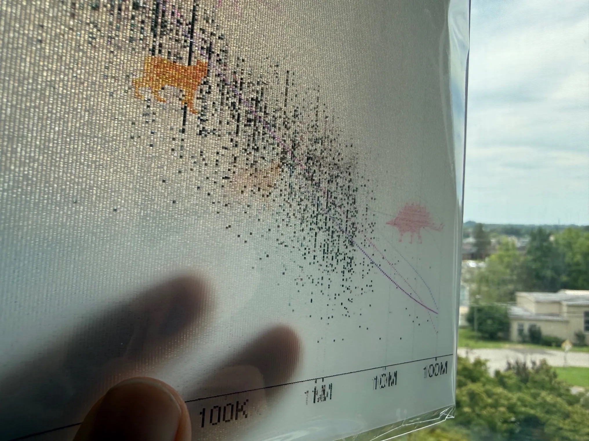
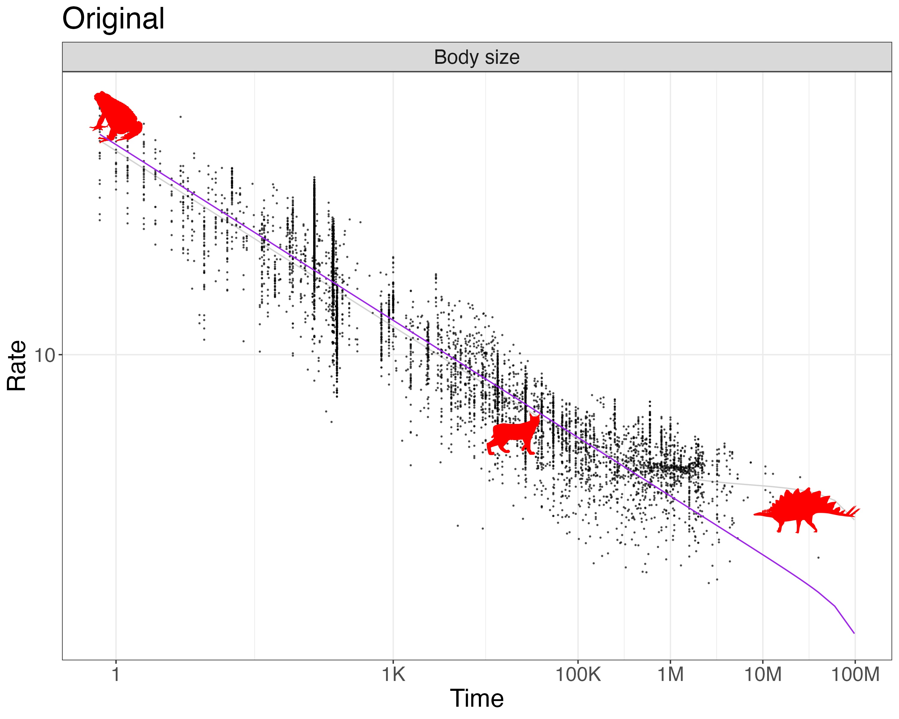
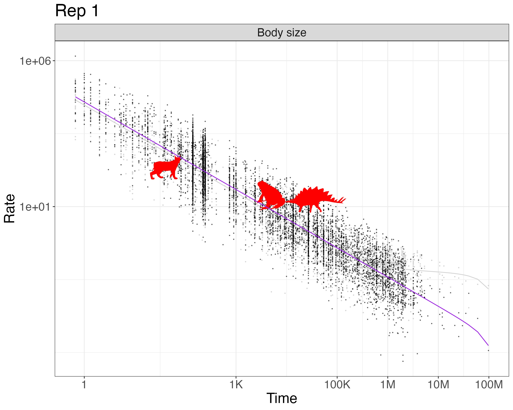
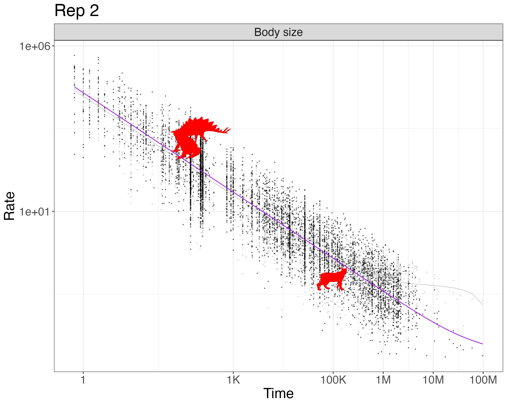

Here is info on our poster for Evolution 2026 in Cleveland, Ohio (download the [PDF](2026vi21_Poster_AgeRateScaling.pdf) or [PPTX](2026vi21_Poster_AgeRateScaling.pptx)).

The poster is on display on Tuesday, June 23, 6 - 8:30 pm, Grand ballroom BC, Poster session 2: "Age-rate scaling in evolution is largely artifactual" Brian O'Meara and [Jeremy Beaulieu](https://www.jeremybeaulieu.org)

## Rationale

There has long been an intriguing pattern in looking at biological rates over time, as shown by this great summary plot from [Rolland et al. (2023)](https://doi.org/10.1038/s41559-023-02116-7):

It would be very interesting if this pattern reflects some real biolgical pattern. But it's sort of weird -- we expect the present and the past to be similar, but these show that as you get closer to the present, rates always speed up, or that over short periods of time rates of evolution are always faster than over longer time periods. I'd expect on average there is roughly a constant rate of, say, DNA substitution, but with changes (at times of less UV radiation, clades with better DNA repair, longer generation times, etc. lower rates; other conditions, higher rates; but not an overall trend). There are things that will constrain amount of change over longer time periods (for example, body size of terrestrial mammals has practical minimum and maximum constraints), but still, the pattern seems a bit suspect. Jeremy Beaulieu and I have been poking at this pattern for years, and eventually wrote a [paper](https://doi.org/10.1371/journal.pcbi.1012458) on this. 

In the paper, we showed that the pattern was nearly indistinguishable from what you'd get from randomizing the amount of change versus time: basically, plotting ∆x/∆t vs ∆t naturally leads to a hyperbola. We also developed an R package, [hyperr8](https://github.com/bomeara/hyperr8), to fit a model to allow separating the hyperbolic component from a rate that might change with time and a constant rate. It doesn't mean all hope is lost -- one reason we made the package is to help detect patterns -- but it's hard to do well.

Recently, [Kinneberg and Lysne Voje (2026)](https://doi.org/10.1093/evolut/qpaf208) included a careful analysis of time series datasets, using simulations to show that a random process would generate a different pattern from the observed empirical one. We were curious to apply our model to their datasets; **the poster is mainly an analysis of this**. The data come from the Phenotypic Evolution Time Series (PETS) [database](https://pets.nhm.uio.no/PETS/) (Rugstad and Lysne Voje, 2023), featuring datasets uploaded by Gene Hunt, Melanie Hopkins, Kjetil Lysne Voje, Audun Rugstad, Mees F. Auener, Anieke Brombacher, Lee Hsiang Liow, Sunniva Løviknes, Kiyoko M. Gotanda, Lucas D. Gorné, Andrew Hendry, Shai Meiri, and Val J. P. Syverson.

We found that most datasets were best fit by hyperbolic models (even though we believe that there is a nonzero underlying true rate of evolution). We highlighted a few to show in our poster, as not all 67 would fit. I chose the top four by dataset size (most power to pick up true patterns and more complex models) and then cherry-picked ones that showed particular interesting patterns, such as ones where the best model included a constant or changing rate of evolution. Here, I include the results for all the datasets, with the ∆AIC values for each model in the last columns of the [csv](summarized_results.csv) file.

## R package

The R package implementing the HMB model is <https://github.com/bomeara/hyperr8>. I plan to add some of the visualization approaches from our paper ([O'Meara and Beaulieu 2024](https://doi.org/10.1371/journal.pcbi.1012458))

## Lenticular

The poster has a missing rectangle in the upper right for Fig 2: that's because I had it printed as a lenticular (remember those awesome bookmarks from elementary school that would show different images as you rotated them? That). 

I uploaded the following images:

**Original**

**Replicate 1**

**Replicate 2**

I used <https://3dreactions.com> to print an 8 x 10" lenticular with three images. It's arranged so that as people horizontally move by the poster (at the conference, and later when I put in the hallway outside my office), they'll see the image shift. My hope is this will draw people in. I probably should have only done two images, not three, but I hope it will work.

## References

* Kinneberg, VB & K Lysne Voje, 2026. “Rate–time scaling in phenotypic evolution: Limitations of current models in capturing temporal dynamics” Evolution 80(1): 97-109
* O’Meara, BC & JM Beaulieu, 2024. “Noise leads to the perceived increase in evolutionary rates over short time scales” PLOS Computational Biology 20(9)
* Rolland, J. et al. 2023. “Conceptual and empirical bridges between micro- and macroevolution” Nature Ecology & Evolution 7(8): 1181-1193
* Rugstad, A. and K. Lysne Voje, 2023. “The Phenotypic Evolution Time Series (pets) Database: Facilitating Research on Phenotypic Change Within Lineages” 10.1130/abs/2023AM-393128
* Phenotypic Evolution Time Series (PETS) database (https://pets.nhm.uio.no/)
* Uyeda, J.C. et al. 2011. “The million-year wait for macroevolutionary bursts” PNAS 108(38): 15908-15913

## Acknowledgements

This work was supported by US NSF grants DEB-1916558 and DEB-1916539. 

___

To subscribe, go to <https://brianomeara.info/blog.xml> in an RSS reader.