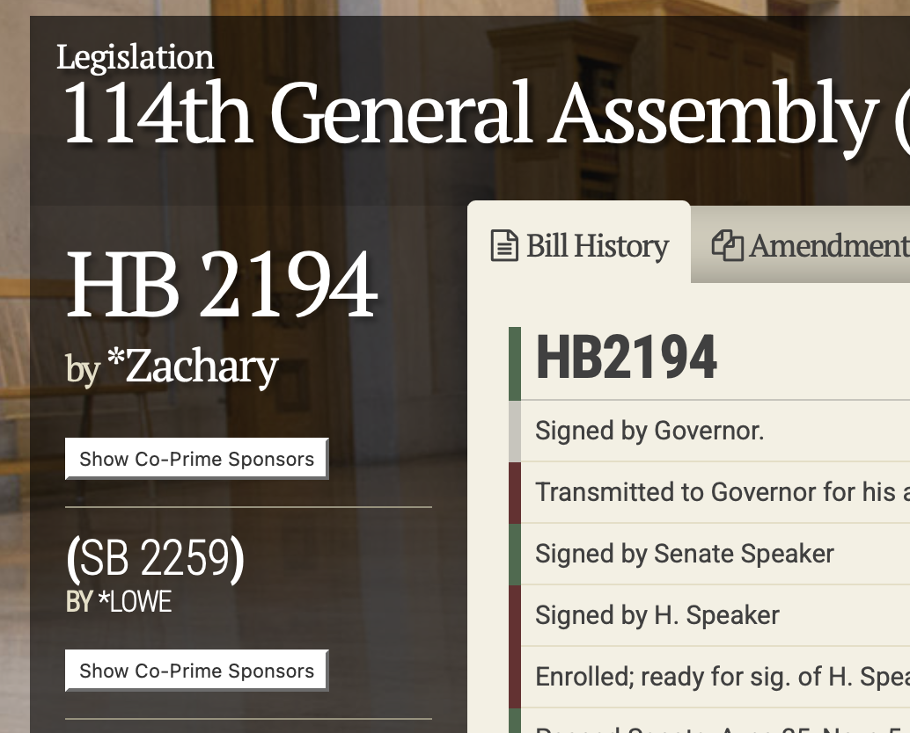

<!--
Uses https://emilhvitfeldt.github.io/quarto-timeline/ for timeline
-->

In the US, a lot of interest focuses on proposed laws at the national level, but individuals' lives can be dramatically affected by legislation passed at the state level. This post describes how I try to keep informed about legislation in the state I live in (Tennessee) but I suspect it will work well for other states, as well. I noticed that friends often are surprised by bills that come through, so I thought it would be useful to have a "how to" on staying aware of legislation.

As an example, let's focus on [House Bill 2194](https://capitol.tn.gov/Bills/114/Bill/HB2194.pdf), Senate Bill 2259, from Tennessee's 114th general assembly, as it will be of interest to others in academia. It was signed into law on April 16, 2026. Its short description, based on the bill at the time it was first introduced (known as caption text), is "Education, Higher - As introduced, requires the board of regents, state university boards, and the board of trustees for the University of Tennessee system to adopt and implement policies that clearly distinguish between tenure decisions and disciplinary actions for faculty members." A couple of sections (but it is worth reading the [full bill](https://capitol.tn.gov/Bills/114/Bill/HB2194.pdf))

> Prior to termination or suspension based on an allegation of misconduct, a tenured or non-tenured faculty member is only entitled to a written notice of the grounds for termination or suspension and an opportunity to be heard by the institution's chief academic officer or chief executive officer. All terminations and suspensions based on an allegation of misconduct by the tenured or non-tenured faculty must be made by the institution's chief executive officer or chief academic officer without any recommendation or vote by another faculty member at the institution.

and 

> The policies adopted pursuant to subsection (b) must:
>  (1) Ensure that awarding, denial, or revocation of tenure is not used as a form of discipline;
>  (2) Ensure that disciplinary actions do not alter or suspend a faculty member's tenure status except as provided by institutional policy and after providing the faculty member due process;
>  (3) Provide disciplinary procedures that are the same for tenured and non-tenured faculty for a faculty member's misconduct;
>  (4) Ensure due process for a faculty member; and
>  (5) Comply with applicable state and federal law.

::: {.callout-tip collapse="true"}
## What is tenure? (click to expand)

[Tenure](https://www.aaup.org/tenure) is a measure intended to preserve academic freedom: a tenured expert in a subject can teach and research without fear of being fired over their speech or findings. For example, someone could do a study of the impact of invasive ivy on local species and not worry that the powerful ivy grower lobby will get them fired if they publish that invasive ivy is harmful, nor worry that their college dean who hates ivy on their buildings will try to fire them if they teach students that invasive ivy is actually beneficial to birds and great to have on University Hall. In a world where "It is difficult to get a man to understand something when his salary depends upon his not understanding it" (quote attributed to Upton Sinclair), tenured faculty are deliberately placed in a situation where their salary does **not** depend on coming to a certain conclusion. Think about the current debate on whether social media use is harmful for children. A social media company that employs a researcher will be much happier if their employee finds social media is good for children; a lobbying group that dislikes social media because it takes ad revenue away from billboards will be happier with their researchers if they report that social media is harmful. The tenured researcher on social media at a college will keep their job no matter what they find, even if the finding annoys one or both groups, and even if it angers all their colleagues in the field of study. They could still feel various pressures about their results (finding a substantial effect is likely to get them more attention, they might like or dislike social media for their own reasons, they suspect their students will have trouble getting jobs if their colleagues think their results are wrong, etc.) but at least the huge pressure of "get fired unless you report/teach what a powerful group likes, not what you think in your expert opinion is true" is not present.

The protections of tenure are not absolute. From the [1940 Statement on Tenure](https://www.aaup.org/sites/default/files/1940%20Statement.pdf): "After the expiration of a probationary period, teachers or investigators should have permanent or continuous tenure, and their service should be terminated only for adequate cause, except in the case of retirement for age or under extraordinary circumstances because of financial exigencies." Financial exigencies can include threats to a college's survival (such as those that faced [Hampshire College](https://www.hampshire.edu/closure-information)). Adequate cause can cover a variety of issues: as in any group of thousands of people, there are some faculty who do things that warrant firing, so much so that there is at least one database that tracks public cases of academic sexual misconduct (<https://academic-sexual-misconduct-database.org>). Universities have policies in place for disciplining faculty, including dismissal; for example, [here](https://www.ucop.edu/academic-personnel-programs/_files/apm/apm-015.pdf) are the procedures for the University of California, Berkeley. 

:::

The point of this post is not to argue pros or cons of this bill (which has now been signed into a law, and takes effect on July 1, 2026), but rather for explaining how I notice and watch bills like this for those curious about future bills on related topics or other topics of interest can track their progress.

## Finding bills of interest

The first place I go is the page for the state legislature, once the session opens. In many (perhaps all?) states, legislatures do not run continually: a session opens, various bills are introduced; for the ones that eventually become laws, they proceed through committees, potentially receive amendments, are voted on by the state house of representatives and senate, and are then signed by the governor (or vetoed and the veto is overridden, or in some cases go unsigned and become law by default). Sometimes there can be thousands of bills introduced. Some of the bills might be placeholders with more text to be added later, sometimes called "[caption bills](https://www.wkrn.com/news/tennessee-politics/caption-bills-the-bills-designed-to-be-amended/)". Particularly newsworthy bills might be reported on, but there can be others that are important to particular groups but not broadly discussed when first introduced.

In this case, [searching the legislation page for the recently completed 114th General Assembly](https://wapp.capitol.tn.gov/apps/BillSearch/BillSearchAdvanced) for "tenure" will return just 12 bills out of the 2,671 House bills and 2,733 Senate bills. Not all are related to "tenure" in higher education, but many are, and it is few enough that one can look through them all. In Tennessee, they also helpfully organize bills [by subject](https://wapp.capitol.tn.gov/apps/Indexes/SubjectIndex); here are the [ones](https://wapp.capitol.tn.gov/apps/Indexes/BillsBySubject?PrimarySubject=4775&ga=114) related to higher education, for example.

## Tracking bills

Once potential bills are identified, tracking their progress can be useful. Tennessee offers free tracking of bills on its [My Bills](https://wapp.capitol.tn.gov/apps/mybills/login.aspx) page; <https://legiscan.com> is a service that covers all US states and the US Congress, free for most uses (I'm not affiliated with this site, I just use it sometimes).

## Reading bills

Novels, poems, scientific papers all are different forms of writing that take a bit of experience to understand. So are bills -- they can be a bit opaque at first, but they are generally understandable. I find the easiest bills to understand are ones that are a distinct new law (for example, a new law on AI probably is not modifying any old laws). It can be harder if a bill is modifying different sections of an existing law: dropping a paragraph here, adding one there, etc. (side note: it would be great for a state to put its laws freely available on git and treat proposed bills as pull requests, like the [Society of Systematic Biologists does](https://github.com/systbiol/docs/network)). Sample bill language is often created by various advocacy groups; legislators can use this as a starting point for crafting their own bills (for those interested in looking at those relationships, this [*Science* article](https://doi.org/10.1126/science.aad4057) by my former postdoc Nick Matzke can be illuminating).

{width=200 fig-alt="A screen shot of the top left of the bill webpage, https://wapp.capitol.tn.gov/apps/BillInfo/Default?BillNumber=HB2194&ga=114."}

To see the actual text, click on the bill number on top left of the [page](https://wapp.capitol.tn.gov/apps/BillInfo/Default?BillNumber=HB2194&ga=114): "HB 2194" in this case. The title is a link to the PDF, even though it is not underlined and so does not look like a link.

Note that House and Senate versions of bills can differ. You can click on the link below the current bill (i.e., click on "(SB 2259)") to go to the bill's page in the other legislative body, then click on the new top title to get the bill text.

## Follow the money

New laws can affect state government revenue and expenditures. A tax targeting electric and hybrid vehicles can raise money for road maintenance; creation of a new state park will require funds to hire rangers, build infrastructure, and so forth. Sometimes there may be costs even if the bill does not call for spending or taxes/fees directly: for example, some potential laws if enacted are likely to spur lawsuits by those opposed to the law, and defending the state against those lawsuits will likely cost money. No one can know exactly how many lawsuits will result, how hard the litigation might be, but it can be useful to have a best effort estimate. If a bill is likely to result in potentially large financial costs, legislators might be less likely to vote for it. 

For the focal bill for this blog post, the fiscal analysis is [here](https://capitol.tn.gov/Bills/114/Fiscal/SB2259.pdf). The analyst ruled it "not significant." It doesn't mean that this will have no financial impact: defending against lawsuits from fired faculty will cost money, not having to defend against lawsuits by those who fired faculty would have victimized had they stayed longer could save money, making recruiting excellent faculty easier or harder (thus less or more expensive) depending on whether they like or dislike the new policy, etc. But at the state budget level, the analyst concluded the overall impact would be slight.

## Bill stopping points

Amendments can change bills, and reconciliation of two different versions of the bill (one from House, one from Senate) can also result in changes (though at least in Tennessee, one chamber adopting the version from the other chamber isn't uncommon, eliminating the need for reconciliation in such cases). There are several points where a bill's progress to becoming a law can pause or stop (and a pause, if it lasts longer than the session, becomes a stop, though the same bill could be re-introduced in the future and start again):

* No one introduces it to the other chamber -- for example, it has a House sponsor but no Senate sponsor.
* It is introduced but a sponsor withdraws it from consideration.
* The relevant committee (a subset of the legislature that focuses on bills relating to a particular area) does not add it to its agenda for a discussion or vote.
* The committee does not vote for it to advance out of committee.
* If it does advance out of committee, it does not get added to the agenda of the full House or Senate.
* At least one legislative body does not vote it for approval.
* Both the House and Senate approve it, but the governor vetoes it and the veto is not overridden.

There may be other stop points, but these are the ones I have noticed most often. The veto process is interesting. At the federal level, a 2/3 vote of each legislative body is required to override a veto, making it a high bar. In Tennessee, it just requires a simple majority to override a veto (the same as to pass the bill originally), though legislators' minds might change about the bill given the governor's arguments when choosing to veto it. Your state may have its own rules.

Once a bill passes all these stages, it becomes a law (often with a start date some months later, usually July). It could later be ruled unconstitutional, though many bills now have severability clauses: if part of a law is ruled unconstitutional, the other parts remain in effect.

## Timeline

It can be worth looking at the timeline of progress of a bill, including when it was reported on. If all you do is learn about bills from the news, when do you see it? Focusing on some (not all) key events for HB2194/SB2259:

::: {.timeline .vertical}
::: {.event data-label="Feb 2, 2026"}
**Introduction**
Bill introduced in House and Senate
:::
::: {.event data-label="Feb 18, 2026"}
**House Higher Ed Subcommittee**
Recommended for passage: 5-1
:::
::: {.event data-label="Mar 3, 2026"}
**House Education Committee**
Recommended for passage: 13-3
:::
::: {.event data-label="Mar 5, 2026"}
**House Calendar & Rules Committee**
Placed on calendar, voice vote
:::
::: {.event data-label="Mar 9, 2026"}
**House Floor Vote**
Approved amendment: 72-21
Approved bill: 70-21
:::
::: {.event data-label="Mar 11, 2026"}
**Senate Education Committee**
Recommended for passage: 8-0
:::
::: {.event data-label="Mar 18, 2026" style="--tl-color-label: #ff0000; --tl-color-dot: #ff0000;"}
***Knox News Sentinel***
[Newspaper article](https://www.knoxnews.com/story/news/education/2026/03/18/state-bill-aims-to-strip-acedmic-tenure-protections-tennessee-universities/89120901007/) by Keenan Thomas on the bill's progress
:::
::: {.event data-label="Mar 23, 2026"}
**Senate Floor Vote**
Approved bill: 25-5
:::
::: {.event data-label="Apr 3, 2026" style="--tl-color-label: #ff0000; --tl-color-dot: #ff0000;"}
**WBIR**
[News story](https://www.wbir.com/article/news/local/knoxville/tennessee-bill-altering-tenure-protections-governors-desk/51-0b2f6a31-2222-45f7-a0f1-ee2c762679b9) on the bill going to the Governor's desk for a signature.
:::
::: {.event data-label="Apr 10, 2026" style="--tl-color-label: #ff0000; --tl-color-dot: #ff0000;"}
***Inside Higher Ed***
[Article](https://www.insidehighered.com/news/government/state-policy/2026/04/10/bills-weakening-tenure-abolishing-faculty-senates-advance) by Emma Whitford on this bill and others in different states as "4 State Bills Faculty Should Watch"
:::
::: {.event data-label="Apr 16, 2026"}
**Signed by governor**
:::
::: {.event data-label="July 1, 2026"}
**Law takes effect**
:::
:::

Note that frequent observers of higher ed in Tennessee, [*Chronicle of Higher Ed*](https://www.chronicle.com), the [TN Conference of the AAUP](https://web.archive.org/web/20260419143718/https://taaup.org/) and the [United Campus Workers](https://web.archive.org/web/20260419150054/https://ucwtn.org/news), as of drafting this post (first draft April 18, 2026) apparently have no information about this bill on their websites (but I can't speak to any internal, non-public communications, which can often be effective). A bigger point is that a lot of the news coverage happened fairly late in the process; the first article I could find was after the bill passed the House and had already passed the Senate Education Committee, and most reporting was after the bill passed the House and Senate with veto-proof majorities. This is not a criticism of the reporting -- there are thousands of bills, most do not become laws, and there just isn't enough news capacity to cover each at inception -- but it is an argument for watching legislation oneself rather than to wait for when it hits the news.

## What to *do* about bills?

This post is all about how to find and watch bills. What if one wants to help a bill get passed, or fail, or change in some way? I honestly do not know what works best. For many issues there are advocacy groups on multiple sides who presumably have decent strategies. In some cases, it seems that attention can cause a change one wants to see; in others, lack of noisy attention allows quiet individual advocacy to work to get a change one wants. I have not delved into the peer-reviewed literature on ways to make effective impact on proposed legislation to the extent that I would want to make recommendations.

However, one assured way to make sure a legislator pays attention to your views is to *be* that legislator. For most roles in Tennessee, for example, one needs a form with just 25 elgible voters supporting your candidacy to run. That said, political parties may have their own standards: it's a [straightforward process to run for governor](https://sos.tn.gov/elections/guides/how-to-run-for-tennessee-governor), for example, but if you want to be the __ Party nominee for governor, the relevant party may have its own criteria.

## Caveats

Note this blog post is written in my personal capacity on my personal website, not as part of any professional role at any institution or society. I am not advocating for or against any legislation or candidate in this post.

___

To subscribe, go to <https://brianomeara.info/blog.xml> in an RSS reader.
